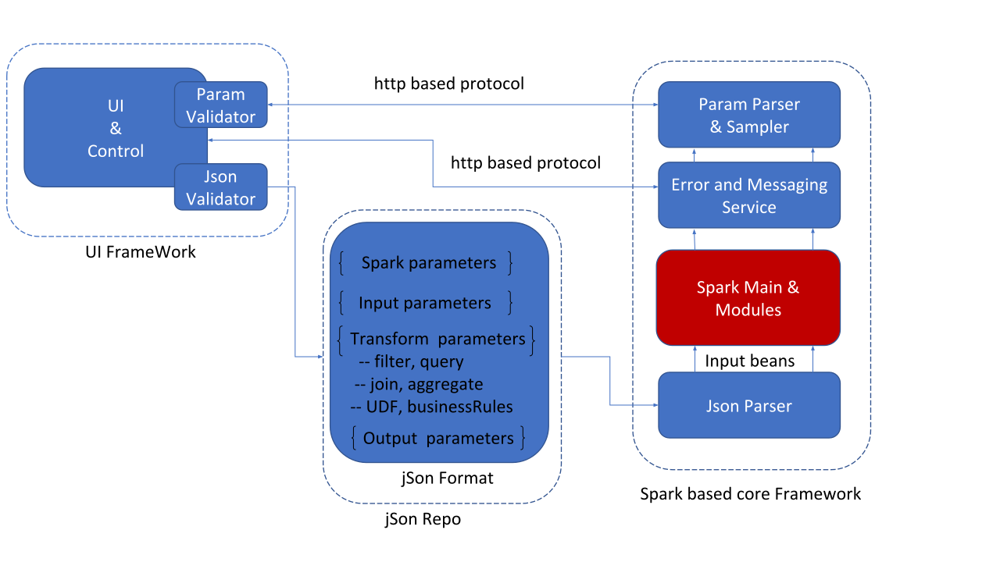

**Framework Readme**
**Date 02-Nov-2018**
**V.0.0.1**

## Why Framework is needed

Framework is JSON based data processing module which converts JSON into Apache Spark code and runs on spark cluster.

1. How it will help you ?
2. You do not need spark developers to write data processing code
3. It will enhance the development time
4. Traditional SQL based data processing can be easily changed to JSON
5. Data Processing and Data Storage can be combined
6. Easy to wrap up code and run on cloud

### Architecture

TBD


TBD


## Using Framework

This json contains 4 major block - sparkconfig,datasources, transformations and outputs.

sparkconfig is optional and it takes the spark parameter. If this block is not there it will take parameter from spark-submit.

```json
"sparkconfig": 
    {
      "appname": "TransformRunner",
      "master":"local[3]",
      "verbose":"true",
      "noexecutor":"3",
      "nocore":"3",
      "executormemory":"3G",
	"confparam":"spark.speculation,false,spark.hadoop.mapreduce.map.speculative,false,spark.hadoop.mapreduce.reduce.speculative,false"
    }
```


 datasources is must and and an array which takes input files or folder to load as dataframe. At present parquet,csv and text format are support. Multiple input files are loaded.

```json
"datasources": [
    {
      "name": "SampleData",
"location":"/Users/vsingh007c/Downloads/ modified.csv",
      "locationType": "static",
      "format": "csv",
      "selectedColumns": []
},
{
   "name": "ORIG",
      "location":"/Users/vsingh007c/Downloads/parquer_directory",
      "locationType": "static",
      "format": "parquet",
      "selectedColumns": [] // empty means load all columns
    }
]
```

 transformations is top level key which is array type. It also has “conditions” key which is array type. It takes a dataframe and apply transformation on it and save the output as another dataframe. If the name and source is same it will override the same dataframe.


```json
{
      "name": "SampleData", // name of dataframe after transformation
      "type": "sampling",  // which type of transformation is applied
      "source": "SampleData", // input dataframe
      "priority": 1, // first in data pipe line. priority should not be same

      "cache": false, // should the dataframe cached
      "conditions": [ // an array of conditions that needs to be appplied
        {
          "condition": "random", // do random sampling 
          "value": ["0.20"] // sample size 20%
        }
      ]
    }
```

Following “transformations”.type are supported for now
“join”,”filter”,”query”,”aggregate”,”enrichment”,”sampling”,”profile”,”transforamtion” The conditions array values will change to as per type value.


If transformation is “join” type following  are supported

"transformations"."conditions"."joinType" are supported – “inner, cross, outer, full, full_outer, left, left_outer, right, right_outer, left_semi, left_anti”,unionall”,”except”,”intersect”. It uses spark jointype in backend so if apache spark supports more joins it will support more join.

```json
{
      "name": "ORIG-DELTA-JOIN",
      "type": "join",
      "source": "ORIG,DELTA",
      "priority": 1,
      "cache": false,
      "conditions": [

{
          "joinType": "left_outer",
          "leftcolumn": "rename1,rename2,rename3",
          "condition": "not equal",
          "rightcolumn": "rename1,rename2",
          "dropcolumn": "rename2"
        }
      ]
    }
```

"transformations"."conditions"." condition " are supported – “equal”,”not equal”, “less than equal”, ‘greater than equal”

unionAll will merge two dataset based on rows like sql union
except will merge two dataset based on rows like sql except
intersecct will merge two dataset based on rows like sql intersect


b.) If transformation is “aggregate” type following  are supported

"transformations"."conditions"." condition " – “groupby”
"transformations"."conditions"."aggrcondition" – it is key val pair of columns and aggregate type separated by comma. These are aggregate types are supported  - min,max,count,sum,avg

          "aggrcondition": "di_sequence_number,max,col2,min"

"transformations"."conditions"." value " is an array which takes all column on which you want to do groupby in same order separated by “,” (comma)

```json
{
      "name": "Groupdata",
      "type": "aggregate",
      "source": "ORIG-DELTA-JOIN",
      "priority": 2,
      "cache": false,
      "conditions": [
        {
          "condition": "groupby",
          "value": [ "col1","col2","col3","col4"], // groupby on given columns
          "aggrcondition": "col1,max" // take max of column 1
        }
      ]
    },
```

If transformation is “enrichment” type following  are supported
"transformations"."conditions"." condition " – “nullreplace”,”dropcolumns”,”addcolumns”,”renamecolumns”,”reordercolumns”,”repalcecolumns”,”renameallcolumns”

"transformations"."conditions"."aggrcondition" is key value pair of column and replace with value , separated by comma like
"aggrcondition": "testcolumn,1"

It will replace column “testcolumn” null values with “1”.

```json
{
      "name": "Cleandata",
      "type": "enrichment",
      "source": "Groupdata",
      "priority": 3,
      "cache": false,
      "conditions": [
        {
          "condition": "nullreplace",
          "aggrcondition": "testcolumn,1" // replace null from testcolumn with 1
        },
{
          "condition": "reordercolumns",
          "aggrcondition": "rename1,rename2,rename3"
        }
      ]
    }
```


examples for addcolumns and renamecolumns

```json
{
      "name": "SampleData",
      "type": "enrichment",
      "source": "SampleData",
      "priority": 4,
      "cache": false,
      "conditions": [
        {
          "condition": "addcolumns",
          "aggrcondition": "testcolumn1:trim(col10):substrcol1:substr(now(),1,4):newcolumn:concat(testcolumn1,col4)" // here is separator is : as functions might have , as parameters
// It will add column testcolumn1 which is trim of col19, will add column substrcol1 which is substring of function now() 

// it uses sql type function to create new columns from existing columns. If a literal is given it will populate the column with same literals.

        }
      ]
    },
    {
      "name": "SampleData",
      "type": "enrichment",
      "source": "SampleData",
      "priority": 8,
      "cache": false,
      "conditions": [
        {
          "condition": "renamecolumns",
          "aggrcondition": "testcolumn1,rename1,substrcol1,rename2,newcolumn,rename3" // rename testcolumn1 to rename1, substrcol1 column to rename2 and so on
        }
      ]
    },
{
          "condition": "renameallcolumns",
          "aggrcondition": "sample_"
        }
```

If transformation is “filter” type following  are supported

"transformations"."conditions"." condition " – “GREATER”,”LESS”,”EQUALS”,”NOTEQUALS”,”IN”,GREATEREQUAL”,”LESSEQUAL”,”EXPRESSION”,”LIKE”,”RLIKE”,DROPDUPLICATES, SELECTEXPR

```json
{
      "name": "SampleData-Filter",
      "type": "filter",
      "source": "SampleData",
      "priority": 3,
      "cache": false,
      "conditions": [
        {
          "column": "col10", // apply filter on this column
          "condition": "GREATER",
          "value": ["variable","datenow","yyyy"], // use used define function datenow with parameter “YYYY” which output should be applied for filter
          "datatype": "Long"
        },
{
          "column": "col1", // apply filter on this column
          "condition": "GREATER",
          "value": ["constant","10”], //pull all the rows which are greater than 10          "datatype": "Long"
        },
{
          "condition": "Expression",
          "value": ["constant","col5 is null"],
          "datatype": "String"
        },
{
          "condition": "RLIKE",
          "column":"col6",
          "value": ["constant","^N"],
          "datatype": "String"
        },
        {
          "condition": "DROPDUPLICATES",
          "value": ["constant","col6","col10"],
          "datatype": "String"
        },
        {
          "condition": "selectexpr",
          "value": ["constant","col6","col10 as none", "'5'", "*"],
          "datatype": "String"
        }

      ]
    }
```

If transformation is “query” type following  are supported

"transformations"."conditions"." sql " – sql will be fired on the dataframe “name” after registering as table in spark like

```json
{
"name": "STBSQLMETRIC",
      "type": "query",
      "source": "STB-PN-JOIN",
      "priority": 5,
      "cache": false,
      "conditions": [
        {
          "sql": "select Programmer,count(*) from STBSQLMETRIC group by Programmer"
        }
      ]
    }
```

If transformation is “sampling” type following  are supported
“random” and “stratified” 

```json
{
      "name": "StratifiedData",
      "type": "sampling",
      "source": "SampleData",
      "priority": 6,
      "cache": false,
      "conditions": [
        {
          "condition": "stratified",
          "value": ["0.002","I","0.8"],
          "column": "col2" // make stratified sampling based on values of col2, if values if not given then default is 0.002 else use the value given like value “I” should be taken 80%. A default value 0.00 mean only values given in array in taken
        }
      ]
    }
```

If transformation is “transformation” type following  are supported
“udf” and “normalise” 
“zeroscore” and “zscore” are supported for normalized.

```json
{
          "condition":"UDF",
          "funcname":"tolong", // user defined function
          "value": ["LowertestcolumnUDF"], // column input for UDF function
          "column": "longLowertestcolumnUDF", // name of column after applying UDF
          "datatype": "Long" // datatype of output column
        },
        {
          "condition":"normalise",
          "funcname":"zeroscore", // normalization function to be applied
          "value": ["col10"], // input column for normalization
          "column": "normcol10", // output column name after normalization
          "datatype": "Long"
        },
{
          "condition":"normalise",
          "funcname":"zscore",
          "value": ["col10"],
          "column": "zcol10",
          "datatype": "Long"
        },
{
          "condition":"UDF",
          "funcname":"regex_replace",
          "value": ["col6"],
          "column": "regexcolumnUDF",
          "aggrcondition": "N.*,vivek",
          "datatype": "string"
        }
}
```

 Outputs: It saves the dataframe as given location. It is an array so multiple dataframes can be added to be saved.

Following json snipped with save dataframe "UDFData-Filter-newCol" at location “/Users/vsingh007c/Downloads/” inside directory BASE_TABLE in parquet format in append mode.

```json
"outputs": [
    {
      "name": "BASE_TABLE",
      "location": "/Users/vsingh007c/Downloads/",
      "sources": ["UDFData-Filter-newCol"],
      "format": "parquet",
      "savemode": "append",
      "selectedColumns": []
    }
  ]
```
Examples: complete json

```json
{
  "sparkconfig": 
    {
      "appname": "TransformRunner",
      "master":"local[3]",
      "verbose":"true",
      "noexecutor":"3",
      "nocore":"3",
      "executormemory":"3G"
    },
  "datasources": [
    {
      "name": "SampleData",
  "location":"/Users/vsingh007c/modified.csv",
      "locationType": "static",
      "format": "csv",
      "selectedColumns": []
    }
  ],
  "transformations": [
    {
      "name": "SampleData",
      "type": "sampling",
      "source": "SampleData",
      "priority": 1,
      "cache": false,
      "conditions": [
        {
          "condition": "random",
          "value": ["0.20"]
        }
      ]
    },
    {
      "name": "SampleData",
      "type": "transformation",
      "source": "SampleData",
      "priority": 2,
      "cache": false,
      "conditions": [
        {
          "condition":"UDF",
          "funcname":"concat",
          "value": [ "col1","col2"],
          "column": "testcolumnUDF",
          "datatype": "string"
        },
        {
          "condition":"UDF",
          "funcname":"tolower",
          "value": ["testcolumnUDF"],
          "column": "LowertestcolumnUDF",
          "datatype": "string"
        },
        {
          "condition":"UDF",
          "funcname":"tolong",
          "value": ["LowertestcolumnUDF"],
          "column": "longLowertestcolumnUDF",
          "datatype": "Long"
        },
        {
          "condition":"normalise",
          "funcname":"zeroscore",
          "value": ["col10"],
          "column": "normcol10",
          "datatype": "Long"
        }
      ]
    },
    {
      "name": "SampleData-Filter",
      "type": "filter",
      "source": "SampleData",
      "priority": 3,
      "cache": false,
      "conditions": [
        {
          "column": "col10",
          "condition": "GREATER",
          "value": ["variable","datenow","yyyy"],
          "datatype": "Long"
        }
      ]
    },
    {
      "name": "SampleData",
      "type": "enrichment",
      "source": "SampleData",
      "priority": 4,
      "cache": false,
      "conditions": [
        {
          "condition": "addcolumns",
          "aggrcondition": "testcolumn1:trim(col10):substrcol1:substr(now(),1,4):newcolumn:concat(testcolumn1,col4)"
        }
      ]
    },
    {
      "name": "SampleData",
      "type": "enrichment",
      "source": "SampleData",
      "priority": 8,
      "cache": false,
      "conditions": [
        {
          "condition": "renamecolumns",
          "aggrcondition": "testcolumn1,rename1,substrcol1,rename2,newcolumn,rename3"
        }
      ]
    },
    {
      "name": "SampleData",
      "type": "join",
      "source": "SampleData,SampleData",
      "priority": 5,
      "cache": false,
      "conditions": [
        {
          "joinType": "Unionall"
        }
      ]
    },
    {
      "name": "Groupdata",
      "type": "aggregate",
      "source": "StratifiedData",
      "priority": 7,
      "cache": false,
      "conditions": [
        {
          "condition": "groupby",
          "value": [ "col2"],
          "aggrcondition": "col2,count"
        }
      ]
    },
    {
      "name": "StratifiedData",
      "type": "sampling",
      "source": "SampleData",
      "priority": 6,
      "cache": false,
      "conditions": [
        {
          "condition": "stratified",
          "value": ["0.002","I","0.8"],
          "column": "col2"
        }
      ]
    }
  ],
  "outputs": [
    {
      "name": "BASE_TABLE",
      "location": "/Users/vsingh007c/Downloads/",
      "sources": ["UDFData-Filter-newCol"],
      "format": "parquet",
      "savemode": "append",// append or overwrite
      "selectedColumns": []
    }
  ]
}
```
